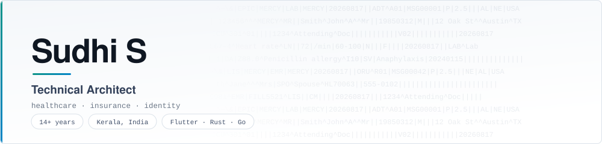

<p align="center">
  <picture>
    <source media="(prefers-color-scheme: dark)" srcset="assets/hero-dark.svg">
    <source media="(prefers-color-scheme: light)" srcset="assets/hero-light.svg">
    
  </picture>
</p>

<p align="center">
  <a href="https://sudhi.in"></a>
  <a href="mailto:support@sudhi.in"></a>
  <a href="https://www.linkedin.com/in/sudhis"></a>
  <a href="https://x.com/su_dhi"></a>
  <a href="https://bsky.app/profile/sudhis.bsky.social"></a>
</p>

<br>

I build systems end to end — Flutter and native mobile clients, the JVM/Go/Python services behind them, and the data pipelines that make them useful. Most of my work is in regulated domains, so HL7, encryption and identity are daily concerns rather than afterthoughts.

Technical Architect at **[Stabilix Solutions](https://www.stabilix.com)** since 2013, working from Trivandrum, Kerala.

> **Currently** — HL7 v2 developer tooling in Rust, native-backed Flutter storage plugins, and Go service libraries. Distributed through Homebrew and pub.dev.

<br>

## Featured work

<table>
<tr>
<td width="50%" valign="top">

### [hl7probe](https://github.com/sudhi001/hl7probe)
<sub>**Rust** · command-line tool · MIT</sub>

Decodes and validates HL7 v2 messages in the terminal. Renames `PID-5` to *Patient Name*, turns `19850312` into *1985-03-12, age 41*, and reports exactly what a receiving hospital system would reject.

No server, no configuration — one binary, one answer.

```sh
brew install sudhi001/tap/hl7probe
```

</td>
<td width="50%" valign="top">

### [FormStack](https://pub.dev/packages/formstack)
<sub>**Dart** · Flutter package</sub>

[](https://pub.dev/packages/formstack)
[](https://pub.dev/packages/formstack/score)
[](https://pub.dev/packages/formstack)

A cross-platform **ResearchKit and ODK alternative** for Flutter. Build dynamic forms and surveys across 35 input types from a declarative spec instead of hand-written screens.

</td>
</tr>
<tr>
<td width="50%" valign="top">

### [native_datastore](https://pub.dev/packages/native_datastore)
<sub>**Dart** · Flutter plugin</sub>

[](https://pub.dev/packages/native_datastore)
[](https://pub.dev/packages/native_datastore/score)
[](https://pub.dev/packages/native_datastore/score)

Persistent key-value storage backed by **Android Jetpack DataStore** and **iOS UserDefaults** — the modern replacement for SharedPreferences.

[Documentation site](https://sudhi001.github.io/native_datastore/) · wiki guides · security policy

</td>
<td width="50%" valign="top">

### [TOML → Android strings.xml](https://plugins.jetbrains.com/plugin/24122-toml-to-android-strings-xml)
<sub>**Kotlin** · JetBrains Marketplace</sub>

[](https://plugins.jetbrains.com/plugin/24122-toml-to-android-strings-xml)

IDE plugin that converts TOML localisation files into Android string resources, removing a manual step from the release process.

Companion widget: [toml_viewer](https://pub.dev/packages/toml_viewer) renders TOML as an interactive tree in Flutter.

</td>
</tr>
<tr>
<td width="50%" valign="top">

### [flutter_crypto_security](https://github.com/sudhi001/flutter_crypto_security) + [crypto_utils](https://github.com/sudhi001/crypto_utils)
<sub>**Dart** and **Go**</sub>

Matched client and server halves of a single crypto contract — RSA/AES encryption with signature verification, proven against each other by a [cross-platform test harness](https://github.com/sudhi001/encryption_cross_platform_test_flutter_golang).

</td>
<td width="50%" valign="top">

### [SmartTerrarium](https://github.com/sudhi001/SmartTerrarium) + [SmartIOTConnect](https://github.com/sudhi001/SmartIOTConnect)
<sub>**C++** and **Dart** · ESP32</sub>

Terrarium irrigation driven by temperature and soil humidity, plus the Flutter app that provisions the board over BLE — firmware and companion app designed as one system.

See also [L_Spectra_Guardian](https://github.com/sudhi001/L_Spectra_Guardian), an ESP8266 air-quality and proximity monitor.

</td>
</tr>
</table>

<details>
<summary><b>More open source</b></summary>
<br>

**Backend libraries — Go**
- [kafka-event-consumer](https://github.com/sudhi001/kafka-event-consumer) — Kafka consumer library with a configurable parallel worker pool and built-in health monitoring
- [badger_db_wrapper](https://github.com/sudhi001/badger_db_wrapper) — ergonomic wrapper over BadgerDB

**Healthcare**
- [HL7_TO_JSON_WITH_FAST_API](https://github.com/sudhi001/HL7_TO_JSON_WITH_FAST_API) — HIPAA-conscious HL7 parsing service

**Developer tooling**
- [AndroidMacroBenchmarkViewer](https://github.com/sudhi001/AndroidMacroBenchmarkViewer) — visualise Android macrobenchmark output in the browser
- [logger_server](https://github.com/sudhi001/logger_server) — remote logging console for mobile developers
- [SFormUI](https://github.com/sudhi001/sfromui) — React form-wizard UI generated from JSON

**Earlier work**
- [couchbase-lite-java-plug](https://github.com/sudhi001/couchbase-lite-java-plug) — Couchbase Lite / Nitrite DB integration for JavaFX
- [UIGridView](https://github.com/sudhi001/UIGridView) — memory-efficient list adapters for Android
- [Bismillah](https://github.com/sudhi001/Bismillah) — Islamic prayer times app

</details>

<br>

## Tech

<p>
  
  
  
  
  
  
  
  
  
  
  
  
</p>

<details>
<summary><b>Full stack, by category</b></summary>
<br>

| | |
|---|---|
| **Languages** | Java · Kotlin · Swift · Dart · Python · Go · Rust · JavaScript · C# · C · C++ · Objective-C · PHP |
| **Mobile** | Flutter · Android (native) · iOS (native) · KMP/KMM · React Native · Ionic |
| **Backend & web** | Spring / Spring Cloud · Javalin · FastAPI · Flask · Node.js · .NET · Vapor · Next.js · React |
| **Desktop** | Flutter · SwiftUI · JavaFX · Electron |
| **Data & ML** | PyTorch · TensorFlow / TF Lite · Keras · CoreML · Spark · NiFi · Hive · Impala · Kudu |
| **Databases** | PostgreSQL · MySQL · MongoDB · SQLite · BadgerDB · Realm · Couchbase Lite · Neo4j |
| **Messaging** | Kafka · RabbitMQ · ActiveMQ · ZeroMQ · MQTT |
| **Protocols & formats** | REST · gRPC · GraphQL · WebSocket · WebRTC · SOAP · HL7 v2 · Protobuf · Avro · Parquet |
| **Cloud & serverless** | AWS (EC2, S3, SNS, SQS, CloudFront, Amplify) · Firebase · Supabase |
| **CI/CD & tooling** | GitHub Actions · Jenkins · Fastlane · Homebrew · Playwright |
| **Embedded** | ESP32 · ESP8266 · Raspberry Pi · Arduino · MicroPython · Embedded Swift |
| **Architecture** | Microservices · MVVM · MVI · VIPER · MVP · MVC |

</details>

<br>

## Experience

**Technical Architect** · Stabilix Solutions · *2013 – present*
Architect systems across healthcare, insurance and identity: big-data analytics pipelines, VOIP and chat frameworks, recommendation engines, and cross-platform Flutter applications spanning mobile, web and desktop. Mentor engineers and translate business requirements into technical design.

**Software Engineer** · Zayan Infotech · *2012 – 2013*
Full-stack development across hospitality, education and utility products; led system integration testing.

<sub>Full history on <a href="https://www.linkedin.com/in/sudhis">LinkedIn</a>.</sub>

<br>

---

<p align="center">
  <sub>
    <a href="https://sudhi.in"><b>sudhi.in</b></a>
    &nbsp;·&nbsp;
    <a href="mailto:support@sudhi.in">support@sudhi.in</a>
    &nbsp;·&nbsp;
    <a href="https://www.linkedin.com/in/sudhis">LinkedIn</a>
  </sub>
</p>
